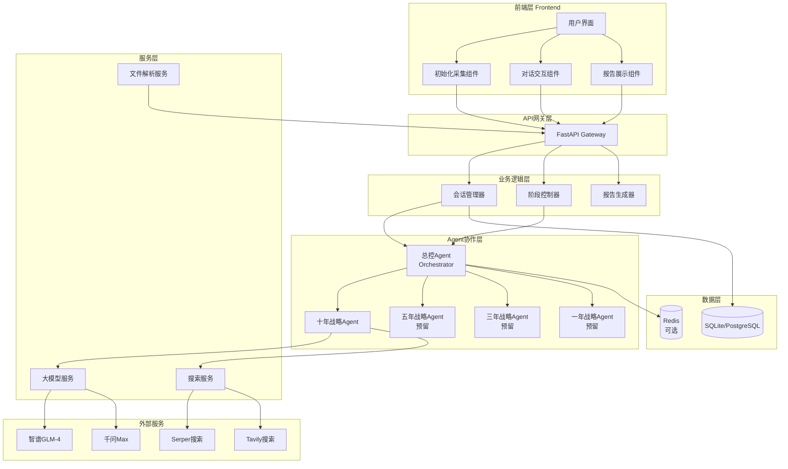
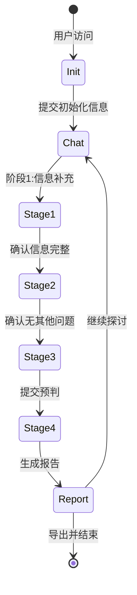
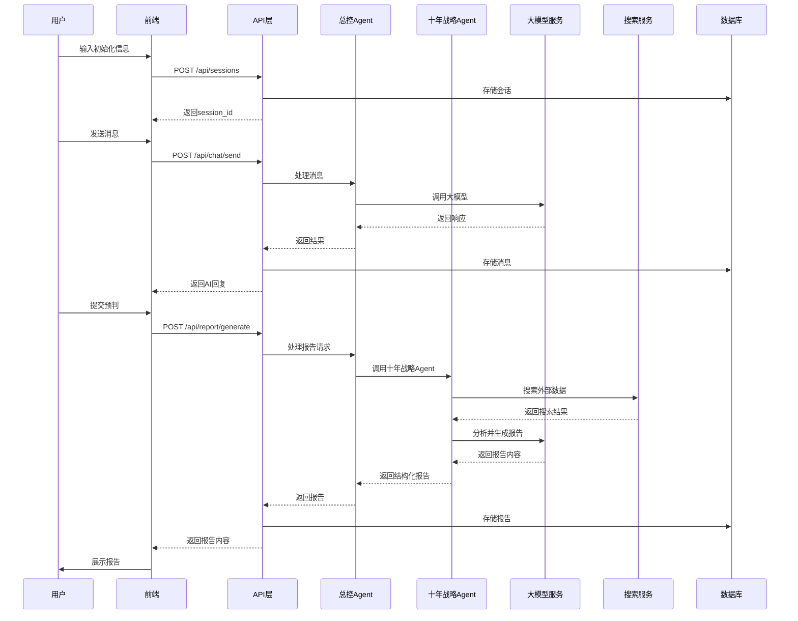

# VMV-SOP战略咨询系统 - 架构设计文档

**文档版本：** v1.0  
**创建日期：** 2026-03-28  
**架构师：** AI架构团队

---

## 一、系统架构总览

### 1.1 整体架构图



### 1.2 技术栈总览

| 层级 | 技术选型 | 版本要求 |
|------|---------|---------|
| 前端框架 | React + TypeScript | React 18+, TS 5+ |
| 构建工具 | Vite | 5+ |
| UI组件库 | Ant Design | 5+ |
| 后端框架 | FastAPI | 0.104+ |
| Agent框架 | LangChain + LangGraph | LangChain 0.1+, LangGraph 0.0.20+ |
| 主模型 | 智谱GLM-4 | - |
| 备用模型 | 千问Max | - |
| 搜索API | Serper / Tavily | - |
| 数据库 | SQLite → PostgreSQL | - |
| 缓存 | Redis（可选） | - |

---

## 二、核心模块设计

### 2.1 前端模块

#### 2.1.1 组件架构

```
src/
├── components/
│   ├── InitForm/                 # 初始化表单组件
│   │   ├── index.tsx             # 主组件
│   │   ├── VisionInput.tsx       # 愿景输入
│   │   ├── MissionInput.tsx      # 使命输入
│   │   ├── ValuesInput.tsx       # 价值观输入
│   │   ├── BasicInfo.tsx         # 基础信息
│   │   └── styles.module.css     # 样式
│   ├── ChatWindow/               # 对话窗口组件
│   │   ├── index.tsx             # 主组件
│   │   ├── MessageList.tsx       # 消息列表
│   │   ├── MessageItem.tsx       # 单条消息
│   │   ├── InputBox.tsx          # 输入框
│   │   ├── FileUpload.tsx        # 文件上传
│   │   └── styles.module.css     # 样式
│   ├── ReportView/               # 报告展示组件
│   │   ├── index.tsx             # 主组件
│   │   ├── ReportSection.tsx     # 报告章节
│   │   ├── ExportButton.tsx      # 导出按钮
│   │   └── styles.module.css     # 样式
│   └── common/                   # 通用组件
│       ├── GlassCard.tsx         # 玻璃拟态卡片
│       ├── Loading.tsx           # 加载动画
│       └── Button.tsx            # 按钮
├── pages/
│   ├── Init.tsx                  # 初始化页
│   ├── Chat.tsx                  # 对话页
│   └── Report.tsx                # 报告页
├── services/
│   ├── api.ts                    # API调用封装
│   ├── session.ts                # 会话服务
│   ├── chat.ts                   # 对话服务
│   └── report.ts                 # 报告服务
├── stores/
│   ├── sessionStore.ts           # 会话状态
│   └── chatStore.ts              # 对话状态
├── styles/
│   ├── glassmorphism.css         # 玻璃拟态样式
│   ├── variables.css             # CSS变量
│   └── global.css                # 全局样式
└── types/
    ├── session.ts                # 会话类型
    ├── message.ts                # 消息类型
    └── report.ts                 # 报告类型
```

#### 2.1.2 页面流程



#### 2.1.3 玻璃拟态UI规范

```css
/* 核心样式变量 */
:root {
  --glass-bg: rgba(255, 255, 255, 0.1);
  --glass-border: rgba(255, 255, 255, 0.2);
  --glass-shadow: 0 8px 32px rgba(0, 0, 0, 0.1);
  --glass-blur: blur(10px);
  --glass-radius: 16px;
  
  --primary-color: #667eea;
  --secondary-color: #764ba2;
  --text-primary: rgba(255, 255, 255, 0.9);
  --text-secondary: rgba(255, 255, 255, 0.7);
}

/* 玻璃卡片基础样式 */
.glass-card {
  background: var(--glass-bg);
  backdrop-filter: var(--glass-blur);
  -webkit-backdrop-filter: var(--glass-blur);
  border: 1px solid var(--glass-border);
  border-radius: var(--glass-radius);
  box-shadow: var(--glass-shadow);
}

/* 多层级效果 */
.glass-card-level-1 {
  background: rgba(255, 255, 255, 0.15);
  backdrop-filter: blur(8px);
}

.glass-card-level-2 {
  background: rgba(255, 255, 255, 0.1);
  backdrop-filter: blur(12px);
}

.glass-card-level-3 {
  background: rgba(255, 255, 255, 0.05);
  backdrop-filter: blur(16px);
}
```

### 2.2 后端模块

#### 2.2.1 目录结构

```
backend/
├── app/
│   ├── __init__.py
│   ├── main.py                   # FastAPI应用入口
│   ├── config.py                 # 配置管理
│   ├── dependencies.py           # 依赖注入
│   ├── models/                   # 数据模型
│   │   ├── __init__.py
│   │   ├── base.py               # 基础模型
│   │   ├── session.py            # 会话模型
│   │   ├── message.py            # 消息模型
│   │   └── report.py             # 报告模型
│   ├── schemas/                  # Pydantic模式
│   │   ├── __init__.py
│   │   ├── session.py            # 会话模式
│   │   ├── message.py            # 消息模式
│   │   └── report.py             # 报告模式
│   ├── api/                      # API路由
│   │   ├── __init__.py
│   │   ├── session.py            # 会话API
│   │   ├── chat.py               # 对话API
│   │   ├── report.py             # 报告API
│   │   └── upload.py             # 文件上传API
│   ├── agents/                   # Agent模块
│   │   ├── __init__.py
│   │   ├── base.py               # Agent基类
│   │   ├── orchestrator.py       # 总控Agent
│   │   ├── ten_year.py           # 十年战略Agent
│   │   ├── five_year.py          # 五年战略Agent(预留)
│   │   ├── three_year.py         # 三年战略Agent(预留)
│   │   └── one_year.py           # 一年战略Agent(预留)
│   ├── services/                 # 服务层
│   │   ├── __init__.py
│   │   ├── llm.py                # 大模型服务
│   │   ├── search.py             # 搜索服务
│   │   ├── file_parser.py        # 文件解析
│   │   └── report_generator.py   # 报告生成
│   ├── core/                     # 核心功能
│   │   ├── __init__.py
│   │   ├── database.py           # 数据库连接
│   │   ├── security.py           # 安全相关
│   │   └── exceptions.py         # 异常处理
│   └── utils/                    # 工具函数
│       ├── __init__.py
│       ├── prompts.py            # Prompt模板
│       └── helpers.py            # 辅助函数
├── tests/                        # 测试
│   ├── test_api/
│   ├── test_agents/
│   └── test_services/
├── requirements.txt
├── .env.example
└── README.md
```

#### 2.2.2 数据模型设计

```python
from sqlalchemy import Column, Integer, String, Text, DateTime, JSON, ForeignKey
from sqlalchemy.orm import relationship
from datetime import datetime
from app.core.database import Base

class Session(Base):
    """
    会话模型 - 存储用户的咨询会话信息
    """
    __tablename__ = "sessions"
    
    id = Column(Integer, primary_key=True, index=True)
    session_id = Column(String(36), unique=True, index=True)  # UUID
    
    # VMV信息
    vision = Column(Text, nullable=True)
    mission = Column(Text, nullable=True)
    values = Column(JSON, nullable=True)  # 列表形式存储多个价值观
    
    # 企业基本信息
    company_name = Column(String(200), nullable=True)
    industry = Column(String(100), nullable=True)
    stage = Column(String(20), nullable=True)  # 0-1, 1-10, 10-N
    team_size = Column(Integer, nullable=True)
    selected_track = Column(Text, nullable=True)  # 选定赛道
    additional_info = Column(Text, nullable=True)
    
    # 会话状态
    current_stage = Column(Integer, default=1)  # 当前阶段 1-4
    status = Column(String(20), default="active")  # active, completed, archived
    
    # 时间戳
    created_at = Column(DateTime, default=datetime.utcnow)
    updated_at = Column(DateTime, default=datetime.utcnow, onupdate=datetime.utcnow)
    
    # 关联
    messages = relationship("Message", back_populates="session", cascade="all, delete-orphan")
    reports = relationship("Report", back_populates="session", cascade="all, delete-orphan")


class Message(Base):
    """
    消息模型 - 存储对话消息
    """
    __tablename__ = "messages"
    
    id = Column(Integer, primary_key=True, index=True)
    session_id = Column(Integer, ForeignKey("sessions.id"))
    role = Column(String(20))  # user, assistant, system
    content = Column(Text)
    stage = Column(Integer)  # 消息所属阶段
    metadata = Column(JSON, nullable=True)  # 额外元数据（如文件信息）
    created_at = Column(DateTime, default=datetime.utcnow)
    
    session = relationship("Session", back_populates="messages")


class Report(Base):
    """
    报告模型 - 存储生成的分析报告
    """
    __tablename__ = "reports"
    
    id = Column(Integer, primary_key=True, index=True)
    session_id = Column(Integer, ForeignKey("sessions.id"))
    report_type = Column(String(50))  # ten_year, five_year, etc.
    title = Column(String(200))
    content = Column(Text)  # Markdown格式
    sources = Column(JSON, nullable=True)  # 信源列表
    created_at = Column(DateTime, default=datetime.utcnow)
    
    session = relationship("Session", back_populates="reports")
```

#### 2.2.3 API接口设计

```python
from fastapi import APIRouter, HTTPException, UploadFile, File
from pydantic import BaseModel
from typing import Optional, List
from datetime import datetime

router = APIRouter()

# ========== 请求/响应模型 ==========

class SessionCreate(BaseModel):
    """创建会话请求"""
    vision: str
    mission: str
    values: List[str]
    company_name: str
    industry: str
    stage: str
    team_size: Optional[int] = None
    selected_track: str
    additional_info: Optional[str] = None

class SessionResponse(BaseModel):
    """会话响应"""
    session_id: str
    current_stage: int
    status: str
    created_at: datetime

class MessageSend(BaseModel):
    """发送消息请求"""
    session_id: str
    content: str
    file_url: Optional[str] = None

class MessageResponse(BaseModel):
    """消息响应"""
    message_id: int
    role: str
    content: str
    created_at: datetime

class ReportGenerate(BaseModel):
    """生成报告请求"""
    session_id: str
    report_type: str = "ten_year"
    prediction: str  # 用户预判内容

class ReportResponse(BaseModel):
    """报告响应"""
    report_id: int
    title: str
    content: str
    sources: List[dict]
    created_at: datetime

# ========== API路由 ==========

@router.post("/sessions", response_model=SessionResponse)
async def create_session(data: SessionCreate):
    """
    创建新会话
    - 接收VMV和基本信息
    - 初始化会话状态
    - 返回会话ID
    """
    pass

@router.get("/sessions/{session_id}", response_model=SessionResponse)
async def get_session(session_id: str):
    """获取会话详情"""
    pass

@router.put("/sessions/{session_id}")
async def update_session(session_id: str, data: dict):
    """更新会话信息（补充VMV等）"""
    pass

@router.post("/chat/send", response_model=MessageResponse)
async def send_message(data: MessageSend):
    """
    发送消息
    - 处理用户输入
    - 调用Agent生成响应
    - 返回AI回复
    """
    pass

@router.get("/chat/history/{session_id}")
async def get_chat_history(session_id: str, limit: int = 50):
    """获取对话历史"""
    pass

@router.post("/chat/upload")
async def upload_file(file: UploadFile = File(...)):
    """
    上传文件
    - 支持PDF、Word、图片
    - 解析文件内容
    - 返回文件ID和提取内容
    """
    pass

@router.post("/report/generate", response_model=ReportResponse)
async def generate_report(data: ReportGenerate):
    """
    生成分析报告
    - 调用十年战略Agent
    - 执行搜索和分析
    - 返回结构化报告
    """
    pass

@router.get("/report/{report_id}/export")
async def export_report(report_id: int, format: str = "md"):
    """
    导出报告
    - format: md, pdf, docx
    - 返回文件下载链接
    """
    pass
```

### 2.3 Agent模块设计

#### 2.3.1 Agent基类

```python
from abc import ABC, abstractmethod
from typing import Dict, Any, List, Optional
from langchain_core.messages import BaseMessage
from app.services.llm import LLMService

class BaseAgent(ABC):
    """
    Agent基类 - 定义所有Agent的通用接口和行为
    """
    
    def __init__(self, name: str, llm_service: LLMService):
        self.name = name
        self.llm_service = llm_service
        self.conversation_history: List[BaseMessage] = []
    
    @abstractmethod
    async def process(self, input_data: Dict[str, Any]) -> Dict[str, Any]:
        """
        处理输入并生成输出
        子类必须实现此方法
        """
        pass
    
    def add_to_history(self, message: BaseMessage):
        """添加消息到对话历史"""
        self.conversation_history.append(message)
    
    def clear_history(self):
        """清空对话历史"""
        self.conversation_history = []
    
    def get_context(self) -> str:
        """获取上下文摘要"""
        return "\n".join([msg.content for msg in self.conversation_history[-10:]])
```

#### 2.3.2 总控Agent (Orchestrator)

```python
from typing import Dict, Any, Optional
from app.agents.base import BaseAgent
from app.agents.ten_year import TenYearAgent
from app.services.llm import LLMService
from app.services.search import SearchService
import app.utils.prompts as prompts

class OrchestratorAgent(BaseAgent):
    """
    总控Agent - 负责调度和协调其他Agent
    核心职责：
    1. 解析用户意图
    2. 维护会话状态和阶段
    3. 调度专业Agent
    4. 整合响应内容
    """
    
    def __init__(self, llm_service: LLMService, search_service: SearchService):
        super().__init__("orchestrator", llm_service)
        self.search_service = search_service
        
        # 初始化专业Agent
        self.ten_year_agent = TenYearAgent(llm_service, search_service)
        # 预留其他Agent
        # self.five_year_agent = FiveYearAgent(llm_service, search_service)
        # self.three_year_agent = ThreeYearAgent(llm_service, search_service)
        # self.one_year_agent = OneYearAgent(llm_service, search_service)
        
        # 会话状态
        self.session_info: Dict[str, Any] = {}
        self.current_stage: int = 1
    
    async def process(self, input_data: Dict[str, Any]) -> Dict[str, Any]:
        """
        处理用户输入
        根据当前阶段和用户意图，决定调用哪个Agent
        """
        user_message = input_data.get("message", "")
        session_info = input_data.get("session_info", {})
        
        # 更新会话信息
        self.session_info.update(session_info)
        
        # 判断用户意图
        intent = await self._detect_intent(user_message)
        
        # 根据意图和阶段路由
        if intent == "generate_report":
            return await self._handle_report_generation(input_data)
        elif intent == "stage_transition":
            return await self._handle_stage_transition(input_data)
        else:
            return await self._handle_general_chat(user_message)
    
    async def _detect_intent(self, message: str) -> str:
        """
        检测用户意图
        返回: generate_report, stage_transition, general_chat
        """
        prompt = prompts.INTENT_DETECTION_PROMPT.format(message=message)
        response = await self.llm_service.generate(prompt)
        return response.strip().lower()
    
    async def _handle_report_generation(self, input_data: Dict[str, Any]) -> Dict[str, Any]:
        """处理报告生成请求"""
        prediction = input_data.get("prediction", "")
        
        # 调用十年战略Agent
        report = await self.ten_year_agent.process({
            "prediction": prediction,
            "session_info": self.session_info,
            "context": self.get_context()
        })
        
        return {
            "type": "report",
            "content": report,
            "stage": 4
        }
    
    async def _handle_stage_transition(self, input_data: Dict[str, Any]) -> Dict[str, Any]:
        """处理阶段转换"""
        self.current_stage += 1
        
        stage_prompts = {
            2: "好的，现在进入自由提问阶段。您有什么想了解或探讨的吗？",
            3: "好的，现在请告诉我您对选定赛道的十年预判：您认为十年后这个赛道会发展成什么样？",
            4: "好的，我将为您生成十年战略分析报告..."
        }
        
        return {
            "type": "stage_transition",
            "content": stage_prompts.get(self.current_stage, ""),
            "stage": self.current_stage
        }
    
    async def _handle_general_chat(self, message: str) -> Dict[str, Any]:
        """处理普通对话"""
        # 构建上下文
        context = self._build_context()
        
        prompt = prompts.GENERAL_CHAT_PROMPT.format(
            context=context,
            session_info=self.session_info,
            message=message,
            current_stage=self.current_stage
        )
        
        response = await self.llm_service.generate(prompt)
        
        return {
            "type": "chat",
            "content": response,
            "stage": self.current_stage
        }
    
    def _build_context(self) -> str:
        """构建对话上下文"""
        parts = []
        
        if self.session_info.get("vision"):
            parts.append(f"愿景：{self.session_info['vision']}")
        if self.session_info.get("mission"):
            parts.append(f"使命：{self.session_info['mission']}")
        if self.session_info.get("selected_track"):
            parts.append(f"选定赛道：{self.session_info['selected_track']}")
        
        parts.append(f"当前阶段：第{self.current_stage}阶段")
        
        return "\n".join(parts)
```

#### 2.3.3 十年战略Agent

```python
from typing import Dict, Any, List
from app.agents.base import BaseAgent
from app.services.llm import LLMService
from app.services.search import SearchService
import app.utils.prompts as prompts

class TenYearAgent(BaseAgent):
    """
    十年战略Agent - 负责赛道预判分析
    核心职责：
    1. 解析用户预判
    2. 搜索外部数据
    3. 构建正反论据
    4. 生成综合判断
    """
    
    def __init__(self, llm_service: LLMService, search_service: SearchService):
        super().__init__("ten_year_strategy", llm_service)
        self.search_service = search_service
    
    async def process(self, input_data: Dict[str, Any]) -> Dict[str, Any]:
        """
        处理预判分析
        输入：用户预判、会话信息、上下文
        输出：结构化分析报告
        """
        prediction = input_data.get("prediction", "")
        session_info = input_data.get("session_info", {})
        context = input_data.get("context", "")
        
        # Step 1: 解析预判，提取关键假设
        key_assumptions = await self._extract_assumptions(prediction)
        
        # Step 2: 搜索外部数据
        search_results = await self._search_evidence(key_assumptions, session_info)
        
        # Step 3: 构建正反论据
        arguments = await self._build_arguments(prediction, key_assumptions, search_results)
        
        # Step 4: 生成综合判断
        judgment = await self._generate_judgment(arguments, session_info)
        
        # Step 5: 格式化输出
        report = self._format_report(prediction, arguments, judgment, search_results)
        
        return report
    
    async def _extract_assumptions(self, prediction: str) -> List[str]:
        """
        从预判中提取关键假设
        """
        prompt = prompts.EXTRACT_ASSUMPTIONS_PROMPT.format(prediction=prediction)
        response = await self.llm_service.generate(prompt)
        
        # 解析响应，提取假设列表
        assumptions = [line.strip() for line in response.split("\n") if line.strip()]
        return assumptions[:5]  # 最多5个关键假设
    
    async def _search_evidence(self, assumptions: List[str], session_info: Dict) -> Dict[str, List]:
        """
        搜索支持/反对假设的证据
        """
        results = {
            "supporting": [],
            "opposing": []
        }
        
        track = session_info.get("selected_track", "")
        industry = session_info.get("industry", "")
        
        for assumption in assumptions:
            # 搜索支持证据
            support_query = f"{track} {assumption} 发展趋势 数据 报告"
            support_results = await self.search_service.search(support_query)
            results["supporting"].extend(support_results[:3])
            
            # 搜索反对证据
            oppose_query = f"{track} {assumption} 风险 挑战 问题"
            oppose_results = await self.search_service.search(oppose_query)
            results["opposing"].extend(oppose_results[:3])
        
        return results
    
    async def _build_arguments(
        self, 
        prediction: str, 
        assumptions: List[str], 
        search_results: Dict
    ) -> Dict[str, List]:
        """
        构建正反论据
        """
        prompt = prompts.BUILD_ARGUMENTS_PROMPT.format(
            prediction=prediction,
            assumptions="\n".join(assumptions),
            supporting_evidence=self._format_search_results(search_results["supporting"]),
            opposing_evidence=self._format_search_results(search_results["opposing"])
        )
        
        response = await self.llm_service.generate(prompt)
        
        # 解析响应，提取正反论据
        # 这里需要根据实际响应格式进行解析
        return self._parse_arguments(response)
    
    async def _generate_judgment(self, arguments: Dict, session_info: Dict) -> Dict:
        """
        生成综合判断
        """
        prompt = prompts.GENERATE_JUDGMENT_PROMPT.format(
            positive_args=arguments.get("positive", []),
            negative_args=arguments.get("negative", []),
            session_info=session_info
        )
        
        response = await self.llm_service.generate(prompt)
        
        return self._parse_judgment(response)
    
    def _format_report(
        self, 
        prediction: str, 
        arguments: Dict, 
        judgment: Dict,
        search_results: Dict
    ) -> Dict[str, Any]:
        """
        格式化最终报告
        """
        report = {
            "title": "十年战略预判分析报告",
            "prediction_summary": prediction,
            "positive_arguments": arguments.get("positive", []),
            "negative_arguments": arguments.get("negative", []),
            "judgment": judgment,
            "sources": self._extract_sources(search_results),
            "generated_at": datetime.utcnow().isoformat()
        }
        
        return report
    
    def _format_search_results(self, results: List[Dict]) -> str:
        """格式化搜索结果用于Prompt"""
        formatted = []
        for r in results[:5]:
            formatted.append(f"- {r.get('title', '')}: {r.get('snippet', '')} [来源: {r.get('link', '')}]")
        return "\n".join(formatted)
    
    def _parse_arguments(self, response: str) -> Dict[str, List]:
        """解析AI响应中的论据"""
        # 实现解析逻辑
        pass
    
    def _parse_judgment(self, response: str) -> Dict:
        """解析AI响应中的综合判断"""
        # 实现解析逻辑
        pass
    
    def _extract_sources(self, search_results: Dict) -> List[Dict]:
        """提取所有信源"""
        sources = []
        seen_urls = set()
        
        for result in search_results.get("supporting", []) + search_results.get("opposing", []):
            url = result.get("link", "")
            if url and url not in seen_urls:
                sources.append({
                    "title": result.get("title", ""),
                    "url": url,
                    "snippet": result.get("snippet", "")[:100]
                })
                seen_urls.add(url)
        
        return sources
```

### 2.4 服务层设计

#### 2.4.1 大模型服务

```python
from typing import Optional, List
import httpx
from app.config import settings

class LLMService:
    """
    大模型服务 - 封装多个大模型API调用
    支持主备切换，自动重试
    """
    
    def __init__(self):
        # 主模型配置
        self.primary_provider = settings.LLM_PRIMARY_PROVIDER  # "zhipu"
        self.fallback_provider = settings.LLM_FALLBACK_PROVIDER  # "qwen"
        
        # API密钥
        self.zhipu_api_key = settings.ZHIPU_API_KEY
        self.qwen_api_key = settings.QWEN_API_KEY
        
        # 模型名称
        self.models = {
            "zhipu": "glm-4",
            "qwen": "qwen-max"
        }
    
    async def generate(
        self, 
        prompt: str, 
        temperature: float = 0.7,
        max_tokens: int = 2000,
        provider: Optional[str] = None
    ) -> str:
        """
        生成文本响应
        自动处理主备切换
        """
        providers = [provider] if provider else [self.primary_provider, self.fallback_provider]
        
        for p in providers:
            try:
                if p == "zhipu":
                    return await self._call_zhipu(prompt, temperature, max_tokens)
                elif p == "qwen":
                    return await self._call_qwen(prompt, temperature, max_tokens)
            except Exception as e:
                print(f"模型 {p} 调用失败: {e}")
                continue
        
        raise Exception("所有模型调用失败")
    
    async def _call_zhipu(self, prompt: str, temperature: float, max_tokens: int) -> str:
        """调用智谱API"""
        async with httpx.AsyncClient() as client:
            response = await client.post(
                "https://open.bigmodel.cn/api/paas/v4/chat/completions",
                headers={
                    "Authorization": f"Bearer {self.zhipu_api_key}",
                    "Content-Type": "application/json"
                },
                json={
                    "model": self.models["zhipu"],
                    "messages": [{"role": "user", "content": prompt}],
                    "temperature": temperature,
                    "max_tokens": max_tokens
                },
                timeout=60.0
            )
            response.raise_for_status()
            data = response.json()
            return data["choices"][0]["message"]["content"]
    
    async def _call_qwen(self, prompt: str, temperature: float, max_tokens: int) -> str:
        """调用千问API"""
        async with httpx.AsyncClient() as client:
            response = await client.post(
                "https://dashscope.aliyuncs.com/api/v1/services/aigc/text-generation/generation",
                headers={
                    "Authorization": f"Bearer {self.qwen_api_key}",
                    "Content-Type": "application/json"
                },
                json={
                    "model": self.models["qwen"],
                    "input": {"prompt": prompt},
                    "parameters": {
                        "temperature": temperature,
                        "max_tokens": max_tokens
                    }
                },
                timeout=60.0
            )
            response.raise_for_status()
            data = response.json()
            return data["output"]["text"]
```

#### 2.4.2 搜索服务

```python
from typing import List, Dict
import httpx
from app.config import settings

class SearchService:
    """
    搜索服务 - 封装搜索API调用
    支持多个搜索源
    """
    
    def __init__(self):
        self.serper_api_key = settings.SERPER_API_KEY
        self.tavily_api_key = settings.TAVILY_API_KEY
        self.primary_source = settings.SEARCH_PRIMARY_SOURCE  # "serper"
    
    async def search(self, query: str, num_results: int = 5) -> List[Dict]:
        """
        执行搜索
        返回格式化的搜索结果
        """
        if self.primary_source == "serper":
            return await self._search_serper(query, num_results)
        else:
            return await self._search_tavily(query, num_results)
    
    async def _search_serper(self, query: str, num_results: int) -> List[Dict]:
        """使用Serper搜索"""
        async with httpx.AsyncClient() as client:
            response = await client.post(
                "https://google.serper.dev/search",
                headers={
                    "X-API-KEY": self.serper_api_key,
                    "Content-Type": "application/json"
                },
                json={
                    "q": query,
                    "num": num_results,
                    "hl": "zh-cn"  # 中文结果
                },
                timeout=30.0
            )
            response.raise_for_status()
            data = response.json()
            
            results = []
            for item in data.get("organic", []):
                results.append({
                    "title": item.get("title", ""),
                    "link": item.get("link", ""),
                    "snippet": item.get("snippet", "")
                })
            
            return results
    
    async def _search_tavily(self, query: str, num_results: int) -> List[Dict]:
        """使用Tavily搜索"""
        async with httpx.AsyncClient() as client:
            response = await client.post(
                "https://api.tavily.com/search",
                headers={
                    "Authorization": f"Bearer {self.tavily_api_key}",
                    "Content-Type": "application/json"
                },
                json={
                    "query": query,
                    "max_results": num_results,
                    "include_answer": False
                },
                timeout=30.0
            )
            response.raise_for_status()
            data = response.json()
            
            results = []
            for item in data.get("results", []):
                results.append({
                    "title": item.get("title", ""),
                    "link": item.get("url", ""),
                    "snippet": item.get("content", "")
                })
            
            return results
```

---

## 三、接口契约定义

### 3.1 前后端接口

#### 创建会话

```
POST /api/sessions

Request:
{
  "vision": "成为行业领先的AI战略咨询平台",
  "mission": "帮助创业者做出更明智的战略决策",
  "values": ["专业", "务实", "创新"],
  "company_name": "示例公司",
  "industry": "人工智能",
  "stage": "0-1",
  "team_size": 10,
  "selected_track": "AI教育赛道",
  "additional_info": "专注于K12个性化学习"
}

Response:
{
  "session_id": "uuid-xxxx-xxxx",
  "current_stage": 1,
  "status": "active",
  "created_at": "2026-03-28T10:00:00Z"
}
```

#### 发送消息

```
POST /api/chat/send

Request:
{
  "session_id": "uuid-xxxx-xxxx",
  "content": "我想了解AI教育赛道的竞争格局",
  "file_url": null
}

Response:
{
  "message_id": 123,
  "role": "assistant",
  "content": "AI教育赛道目前呈现以下竞争格局...",
  "created_at": "2026-03-28T10:01:00Z"
}
```

#### 生成报告

```
POST /api/report/generate

Request:
{
  "session_id": "uuid-xxxx-xxxx",
  "report_type": "ten_year",
  "prediction": "我认为十年后AI教育市场规模将达到5000亿，渗透率超过50%"
}

Response:
{
  "report_id": 456,
  "title": "十年战略预判分析报告",
  "content": "# 十年战略预判分析报告\n\n...",
  "sources": [
    {"title": "艾瑞咨询报告", "url": "https://...", "snippet": "..."}
  ],
  "created_at": "2026-03-28T10:05:00Z"
}
```

### 3.2 Agent间接口

#### 总控Agent → 十年战略Agent

```python
input_data = {
    "prediction": "用户预判内容",
    "session_info": {
        "vision": "...",
        "mission": "...",
        "selected_track": "...",
        "industry": "..."
    },
    "context": "对话上下文摘要"
}

output = {
    "title": "报告标题",
    "prediction_summary": "预判摘要",
    "positive_arguments": [...],
    "negative_arguments": [...],
    "judgment": {...},
    "sources": [...]
}
```

---

## 四、数据流向图



---

## 五、异常处理策略

### 5.1 异常类型

| 异常类型 | 触发条件 | 处理策略 |
|---------|---------|---------|
| LLMTimeoutError | 大模型调用超时 | 切换备用模型，重试3次 |
| LLMRateLimitError | API限流 | 等待后重试，提示用户 |
| SearchAPIError | 搜索API失败 | 使用缓存数据或降级处理 |
| FileParseError | 文件解析失败 | 返回错误信息，建议重新上传 |
| DatabaseError | 数据库操作失败 | 记录日志，返回友好错误 |

### 5.2 错误响应格式

```python
{
    "error": {
        "code": "LLM_TIMEOUT",
        "message": "大模型响应超时，正在尝试备用模型...",
        "retry_after": 5
    }
}
```

---

## 六、扩展性设计

### 6.1 新增Agent扩展

```python
# 在orchestrator.py中添加新Agent
from app.agents.five_year import FiveYearAgent

class OrchestratorAgent(BaseAgent):
    def __init__(self, llm_service, search_service):
        # ...
        self.five_year_agent = FiveYearAgent(llm_service, search_service)
    
    async def process(self, input_data):
        # 根据report_type路由到不同Agent
        report_type = input_data.get("report_type", "ten_year")
        
        if report_type == "five_year":
            return await self.five_year_agent.process(input_data)
        # ...
```

### 6.2 新增大模型扩展

```python
# 在llm.py中添加新模型
class LLMService:
    async def _call_new_model(self, prompt, temperature, max_tokens):
        # 实现新模型调用
        pass
    
    async def generate(self, prompt, **kwargs):
        providers = ["zhipu", "qwen", "new_model"]  # 添加到提供者列表
        # ...
```

---

**文档结束**

*本文档将随开发进展持续更新*
